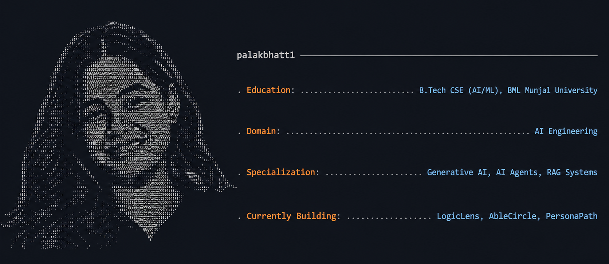

  

<table width="100%" align="center">
<tr>
<td width="50%" valign="top" align="center">

**Languages**

</td>
<td width="50%" valign="top" align="center">

**AI / Deep Learning**

</td>
</tr>
<tr>
<td width="50%" valign="top" align="center">

**GenAI & LLM Ecosystem**

</td>
<td width="50%" valign="top" align="center">

**Backend**

</td>
</tr>
<tr>
<td width="50%" valign="top" align="center">

**Databases**

</td>
<td width="50%" valign="top" align="center">

**Tools**

</td>
</tr>
</table>

<table align="center">
<tr>

<td align="center">

</td>

<td align="center">

</td>

<td align="center">

</td>

</tr>
</table>

<picture>
  <source
    media="(prefers-color-scheme: dark)"
    srcset="https://raw.githubusercontent.com/palakbhatt1/palakbhatt1/output/github-contribution-grid-snake-dark.svg" />

  <source
    media="(prefers-color-scheme: light)"
    srcset="https://raw.githubusercontent.com/palakbhatt1/palakbhatt1/output/github-contribution-grid-snake.svg" />

  

</picture>

